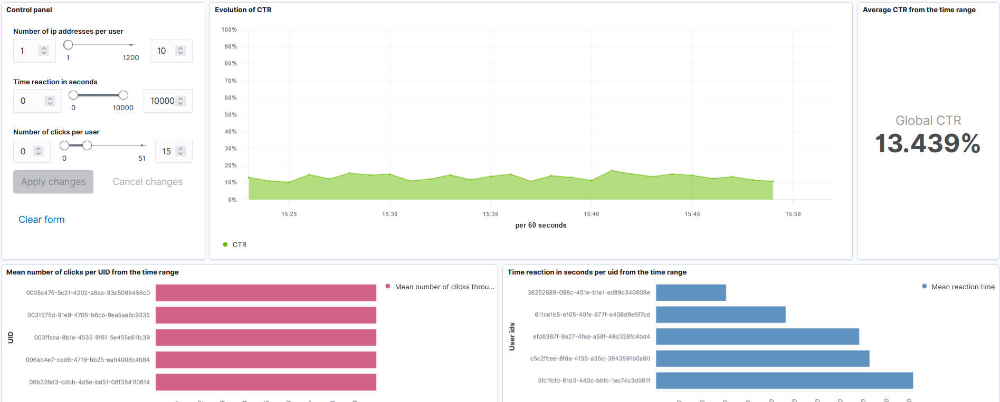

# Suspicious events alerts - Streaming module

This repository contains a Flink application and an Elasticsearch-Kibana pipeline to monitor events on a dashboard.

**Dashboard**


# Get your environment running

## Install Docker

Please follow instructions here : [https://docs.docker.com/v17.09/engine/installation/](https://docs.docker.com/v17.09/engine/installation/)

## Install Maven

Instruction here : [https://maven.apache.org/install.html](https://maven.apache.org/install.html)

## Startup application

1. Install ElasticSearch and Kibana with docker - [docker](https://www.elastic.co/guide/en/elasticsearch/reference/current/docker.html) / [kibana](https://www.elastic.co/guide/en/kibana/current/docker.html)

2. Launch your ElasticSearch and Kibana containers following the instructions in the previous links (If you specify another port for any reasons, make sure that the ports are the same as the one provided in the flink files)

3. Start Kafka cluster

```
$> cd flink-exercices/docker/kafka-zk
$> docker-compose up -d
```

4. Launch the ActivityConsumer main method (for Java).

5. Go to `localhost:5601` to access Kibana. An index named `activitystats` has been created where you can check on
`Menu > Stack Management > Index Management`. Reload indices if necessary.

6. To import the dashboard, go to `Menu > Stack Management > Saved Object > Import` and select the `kibana/dashboard.ndjson` file

7. Click on the dashboard name once loaded or go to `Menu > Dashboard > [Dashboard name]`. You should wait around 10 minutes before a few events is injected to Elasticsearch.


## Read kafka topics using CLI

Now you have a Kafka cluster running, let's try to read from some topics.
`clicks` and `displays` topics should have been automatically created from previous step.
We want to read those topics from our machine (not from a docker container).
Depending on your OS, Kafka is either running on a VM (using docker-machine) or directly in your host.
In the following steps, I'm assuming docker is running directly on your host.
If you use a vm, then we need to update few variables.
TODO....

### Download Kafka scripts
Download https://archive.apache.org/dist/kafka/2.0.1/kafka_2.11-2.0.1.tgz
Then extract the file :
```
$> tar xf kafka_2.11-2.0.1.tgz
$> cd kafka_2.11-2.0.1/bin
$> kafkacat -b localhost:9092 -t clicks
```

You will notice in the python script we're targeting port 9293 since it's running from a container
Cf. kafka cluster config

### Inject events to Kafka

As seen in previous step, Kafka clicks topic is empty, let's generate some events and read them :
In another shell :
```
$> cd flink-exercices/docker/generate_kafka_events
$> docker build -t python-kafka-generate .
```
This will build a simple image with python-kafka dependency.
```
$> docker run -it --network kafka-zk_bridge --rm  -v "$PWD":/usr/src/myapp -w /usr/src/myapp python-kafka-generate python generator.py
```

Now, if you switch back to `kafkacat` shell, you should see many events!


# Task description:

The goal of the project is to create a Flink application which will read from Kafka clicks and displays, detect some suspicious/fraudulent activities and output the suspicious events into a file.

Please download and run this docker-compose file : https://github.com/Sabmit/paris-dauphine/blob/master/docker/kafka-zk/docker-compose.yml

To run it, simply execute `docker-compose rm -f; docker-compose up` in the same directory as the docker-compose.yml file.
By running this docker-compose, it will :
Create a Kafka cluster with two topics : "clicks" and "displays"
Launch a python script which will send events to those two topics and display them in the terminal
This generator simulates few suspicious/fraudulent patterns that you should detect using Flink.
There are 3 distincts patterns we want you to find.

Requirements :
* Project should be made by group of 2 people, we let you make the groups. Please send us an email with the team members within a week (each group send 1mail)
* Deadline for the project : End of may
* You can push the project into a Git repository (preferable) or zip the whole project and send it by email.
* You can choose any language/platform (Java/Scala/Python - MacOS/Linux/Windows)
* You can output to a file (easier), or anything else (Kafka is a must)
* You can ask any question on slack, we will try to be as reactive as possible
* Hint :
  * A normal Click Through Rate is around 10%
  * You may need to do offline analysis to find outliers, it would ease your work.
