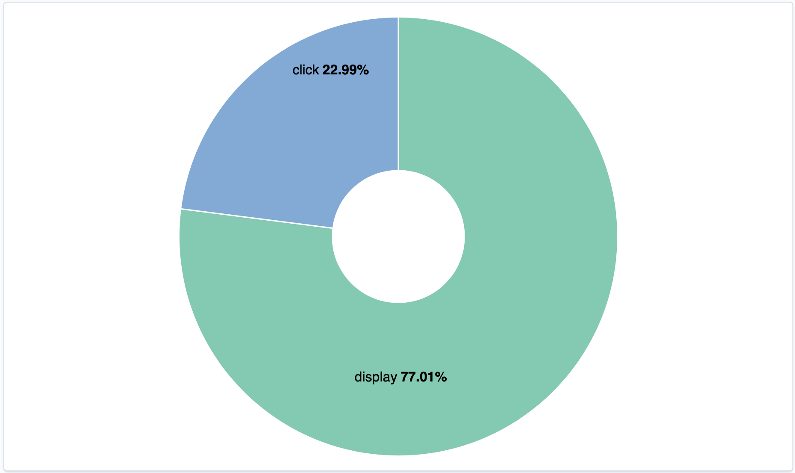
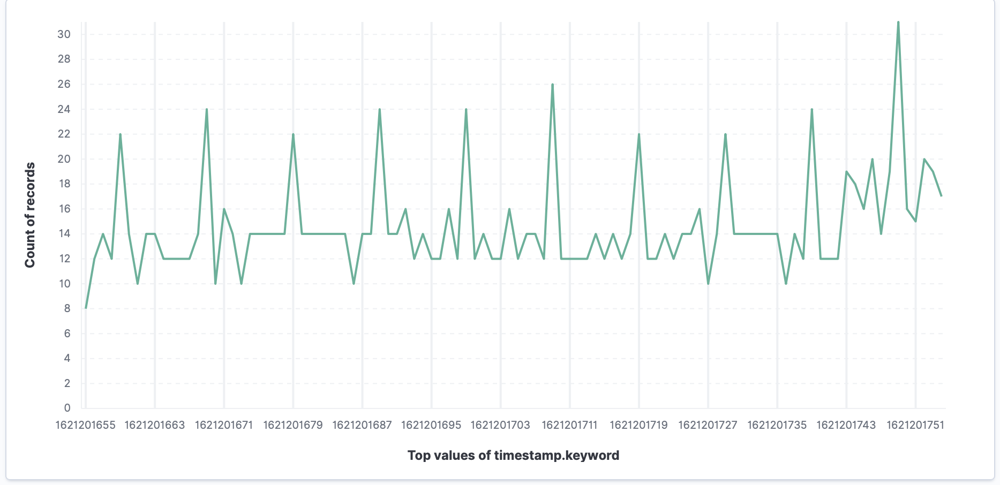
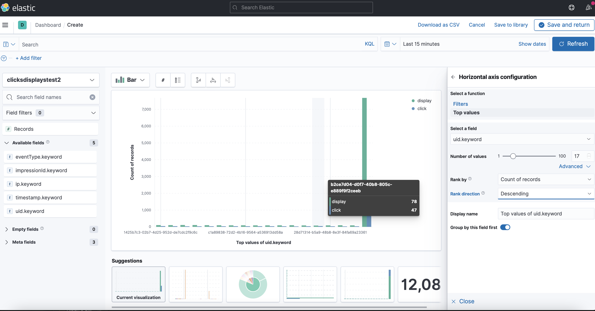

# Basic observabity with Scala 

## Get your environment running

1. Install ElasticSearch and Kibana with docker - [docker](https://www.elastic.co/guide/en/elasticsearch/reference/current/docker.html) / [kibana](https://www.elastic.co/guide/en/kibana/current/docker.html) 

2. Launch your containers following the instructions in the previous links (If you specify another port for any reasons, make sure that the ports are the same as the one provided in the flink files)

3. Launch the StreamingJob main method in the scala folder.

### See some dashboards for analysis

4. Go to Kibana UI : [http://localhost:5601](http://localhost:5601)

5. Add an index pattern (*Tap "Index pattern in the search bar*) corresponding to `displays-clicks-idx` (for Scala) | `clickdisplayidx` (for java) and choose ```timestamp``` as Time field.

6. Go to dashboards (*Click on the toggle on the left side*) to add and visualize your own dashboards 
7. Select : *Create New panel* and click on *Lens* to start doing some visual analysis

#### Example of obtainable dashboard's figures : 
---

**Total number of click in proportion of all events**


---
**Traffic over a period of time**


---
**Nature of events (Click and displays) per users (uid)**


---
